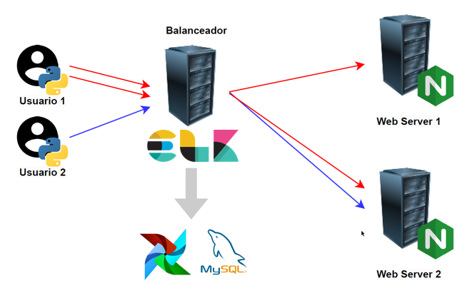

# ELK Airflow - Analysis of Load Balance for Distributed Web Systems

This repo it's used to explain the functionality of a Load Balance Software, fully programmed with Python. 

## Used Services:

* Docker.
* Airflow.
* Nginx.
* Elasticsearch.
* Logstash.
* Kibana.

## Install consideartions:

We need to put the files in order to work correctly in the docker container. I recommend to take some consdierations:

* "docker composer.yml" - yml to deploy the container with all the services and volumes.
* DAGs Python - ".py" files. The name contains "dag". Put it in the dag folder generated for the composer.
* nginx.conf - Nginx configuration file - Put it in the dag folder generated for the composer, configure as you need.
* log tfinal.conf - Logstash configuration file - Put it in the bin folder generated for logstash service.
* BDD MySQL.sql - T-SQL scripts to define all the tables used and some other useful querys.

## General Architecture:

## Dags Considerations:

* "1_dag_ejecutor_curl_basico.py" - It's a first we traffic generator. It's send GET requests using CURL every 5 seconds, the request it's randomly send to one of the nginx services and sections of the website.
* "1_dag_ejecutor_curl_basico.py" - It's a traffic generator for general use. The dag will execute every 2 mins, generating web traffic and logging info to MySQL database.

## Logstash Considerations:

* "log_tfinal.conf" - Generate 3 indexes to elasticsearch, one for the first web service, other for the second web service and the last one to monitoring every 2 mins the historical balancing data on MySQL. Also, logstash insert a row in a log general table on MySQL.

## Nginx Considerations:

* "nginx.conf" - General configuration file with 2 services in localhost (different ports), we custom the log format to get the logstash extraction process easier.

